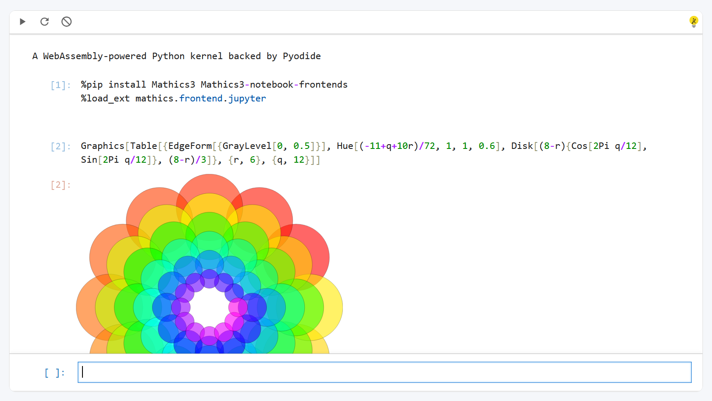

# Mathics3 Live



## Requirements

JupyterLite is being tested against modern web browsers:

- Firefox 90+
- Chromium 89+

## Installing and running locally

```bash
python3 -m venv .venv
source .venv/bin/activate
pip install -r requirements.txt
make serve
```

## Further Information and Updates

For more info, keep an eye on the JupyterLite documentation:

- Deployment: https://jupyterlite.readthedocs.io/en/latest/quickstart/deploy.html
- How-to Guides: https://jupyterlite.readthedocs.io/en/latest/howto/index.html
- Reference: https://jupyterlite.readthedocs.io/en/latest/reference/index.html
