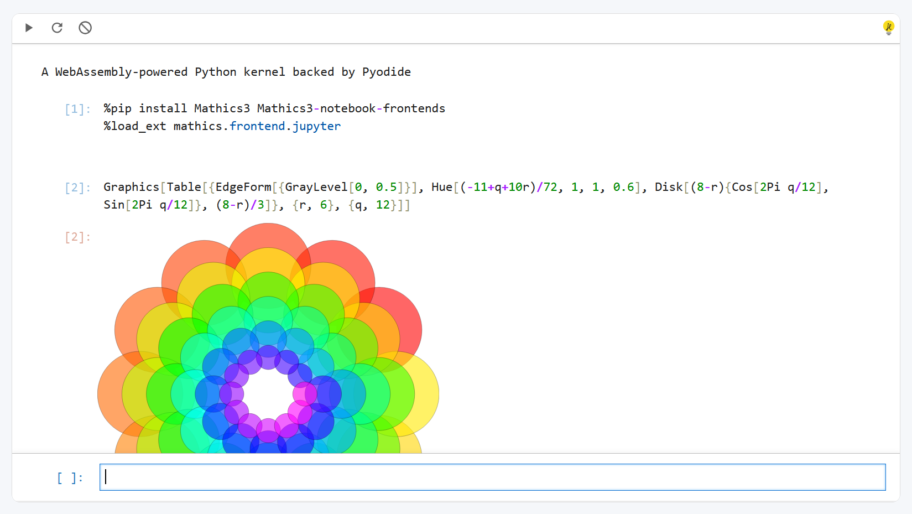

# Mathics3 Live



## Requirements

JupyterLite is being tested against modern web browsers:

- Firefox 90+
- Chromium 89+

## Installing and running locally


###  Install Mathics3-notebook-frontends submodule

After cloning, Mathics3-notebook-frontends needs to be added as a git submodule. To do this:

```console
git submodule --init --recursive
```

If this has been done and Mathics3-notebook-frontends submodule has been updated and need a new branch or an update. Consult practices for working with git submodules.


### Install in a virtual Python environment

To install this code in a virtual Python environment:
```console
python3 -m venv .venv
source .venv/bin/activate
pip install -r requirements.txt
```

The above needs to be done only once.

Once the virtual environment has been set up with the packages installed, to run the server:

```console
make serve
```

## Further Information and Updates

For more info, keep an eye on the JupyterLite documentation:

- Deployment: https://jupyterlite.readthedocs.io/en/latest/quickstart/deploy.html
- How-to Guides: https://jupyterlite.readthedocs.io/en/latest/howto/index.html
- Reference: https://jupyterlite.readthedocs.io/en/latest/reference/index.html
